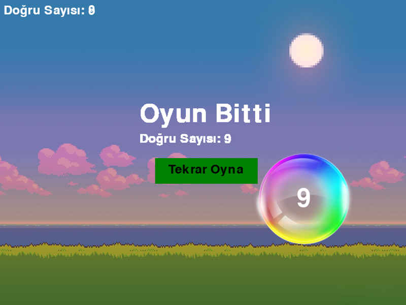

# Eğitici Sayı ve Karakter Bulma Oyunu

### Bu projenin yapımında aşağıdaki araçlar kullanılmıştır.
- Python Programlama Dili
- Pygame Kütüphanesi

### Uygulama Hakkında

Bu proje, kullanıcının belirli bir metinde geçen sayıları ve karakterleri bulmasına yardımcı olan bir oyundur. Kullanıcı metin içinde düşen harfleri gördüğünde ekrandaki harfle aynı tuşa basarak puan kazanır. Harf hızı ve diğer ayarlar kullanıcı tarafından seçilebilir.

### Nasıl Çalıştırılır?

1. Python ve pygame kütüphanesini bilgisayarınıza kurun.
2. Proje dosyalarını indirin.
3. Komut istemcisinde proje dizinine gidin.
4. `python main.py` komutunu çalıştırarak oyunu başlatın.

### Kontroller

- Oyun sırasında, düşen harfi gördüğünüzde klavyedeki aynı harf/sayı tuşuna basın.
- Oyunu duraklatmak için ESC tuşuna basın.

### Ekran Görüntüleri

---

